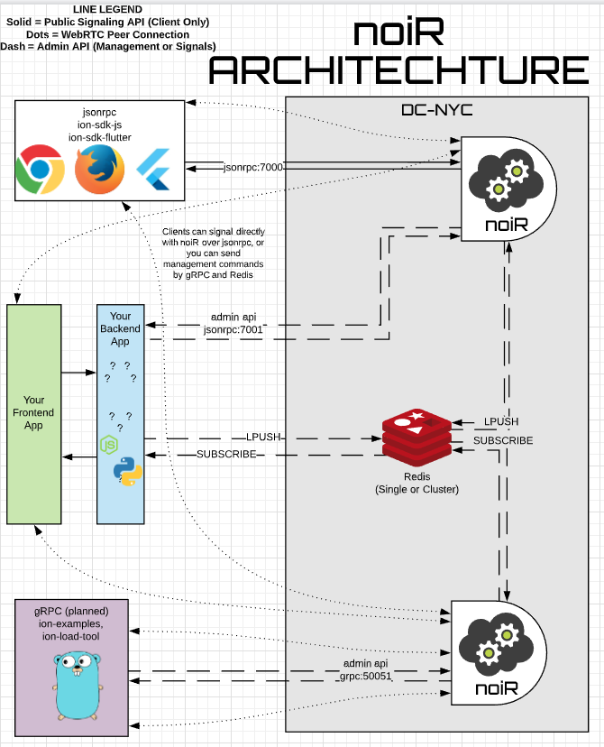

<h1 align="center">
   
  noiR - Redis + ion SFU 
   
</h1>
<h4 align="center">WIP NOTICE: noiR is pre-alpha and unstable, do not build on noiR</h4>

  
  
  
  
  

 

*noiR: it's like R(edis)-ion, but in reverse*

### About

`noiR` is a redis-backed SFU cluster based on [`ion-sfu`](https://github.com/pion/ion-sfu).
It listens on the same ports as `ion-sfu` and accepts the same commands, while adding extra support for
managing membership, and a naive single-datacenter scaling model.

Any ion client can send signaling messages to any `noiR` node in the cluster.
When `noiR` receives a message from a peer, it retains the signaling connection,
but forwards the messages over redis to whichever `noir` node is hosting the room.

`noiR` keeps track of how many publishers or subscribers are in a room, and manages client lifecycle and cleanup.

Clients (callers) can connect directly to `noiR` over public `jsonrpc` interfaces using `ion-sdk-js`
or any regular `ion-sfu` client; management commands get sent over a separate `jsonrpc` interface.

    

### Usage

###### Docker Run Demo
1. Ensure redis is running on your localhost

` docker run -p 6379:6379 --name redis sameersbn/redis redis-cli`

2. Start `noiR` with Demo Mode at [`http://localhost:7070`](http://localhost:7070)

`docker run --net host docker.netprophet.tech/netp/noir:latest -d :7070 -j :7000`

*(instead of host networking, you can use `-p 7070:7070 -p 7000:7000 -p 5000-5020:5000-5020/udp`)*

###### Build Binary
`make build`

###### Build Docker Image
`docker build . -t net-prophet/noir` or `make docker`

### Progress

- [x] Build a naive prototype redis messaging server for `ion-sfu`
- [x] Client JSONRPC API :7000 - JSONRPC-Redis Bridge (so the `ion-sfu/examples` work)
- [x] "Doing It Live" - Adapted my own dependent codebases to start using `noiR` immediately
- [x] "Demo Mode": Bundled `ion-sdk-react` storybooks for instant testing in a browser
- [ ] Learn to write golang unit tests; write unit tests :'(
- [ ] Ensure cleanup safety, no dead peers
- [ ] Admin JSONRPC API :7001 (management commands and/or multiplexed client connections)
- [ ] Admin gRPC API :50051 (management commands and/or multiplexed client connections)
- [ ] Room permissions - Allow/Deny new joins, basicauth room passwords, admin squelch + kick
- [ ] Stream permissions - Fine-grained control over audio/video publish permissions
- [ ] In-cluster SFU-SFU Relay (HA Stream Mirroring, Large Room Support)
- [ ] Cross-cluster SFU-SFU Relay (Geo-Stream Mirroring)

### Motivation

We started this project as an exercise to develop our golang skills, but also to scratch an itch -- `ion-sfu`
aspires to be the most lightweight SFU, the simplest possible version of itself. `noiR` is, by contrast, highly
opinionated and with more batteries included. If you're building a next-generation video conferencing solution,
and want a 20mb micro-SFU with a natural, flexible API for managing your sessions, `noiR` might be right for you.

### Contributing

We eagerly invite contributions and support. The golang might be messy or suboptimal, due to inexperience, 
and drive-by code reviews or notes on how to improve are greatly appreciated. If you'd like to work on `noiR`
but aren't sure how to help, you can get in touch with `oss [@] netprophet [.] tech` or open an issue.

### License

MIT License - see [LICENSE](LICENSE) for full text
